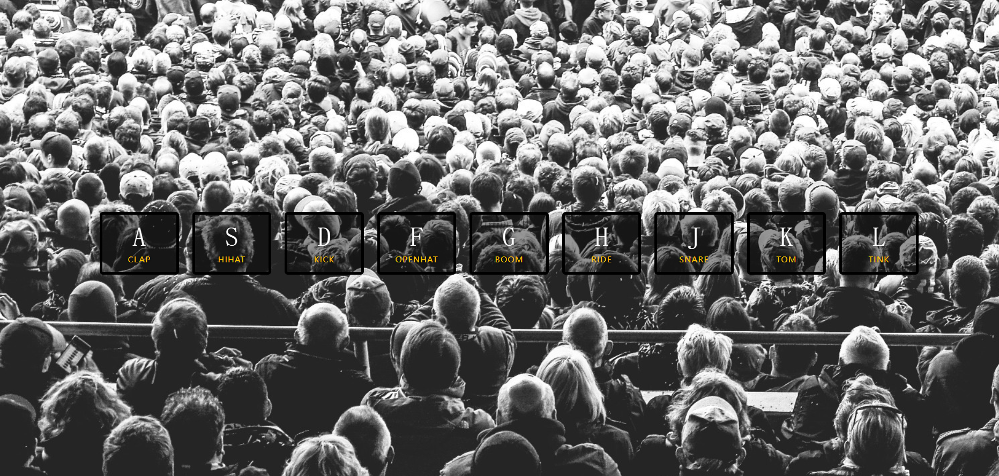
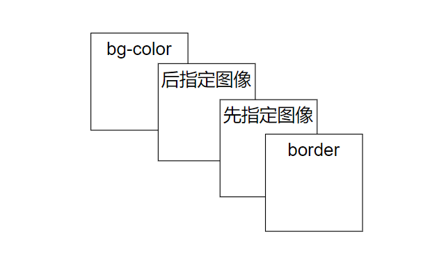
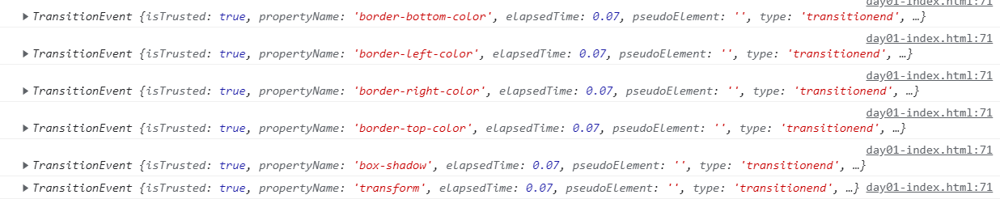

# day1-架子鼓



## 主要的功能

1、当我在键盘上按下相应的按键，他就会发出相应的声音
2、当按下去的时候会有高亮的效果
3、状态需要恢复到原来的状态

## html元素

```javascript
div
span
kbd
//HTML 键盘输入元素 (<kbd>) 用于表示用户输入，它将产生一个行内元素，以浏览器的默认 monospace 字体显示。
audio
```

## css实现

### backound

```javascript
background: url('./background.jpg') bottom center;
//这是一个复合属性
```

- `backound-image`

​    	绘制规则（默认）



- `background-clip` 

  设置元素的背景（背景图片或颜色）是否延伸到边框、内边距盒子、内容盒子下面。

  ```javascript
  background-clip: border-box/padding-box/content-box/text;
  ```

- `background-origin` 规定了指定背景图片[`background-image`](https://developer.mozilla.org/zh-CN/docs/Web/CSS/background-image) 属性的原点位置的背景相对区域。

  ```javascript
  background-origin: border-box/padding-box/content-box
  ```

- **`background-position`** [CSS](https://developer.mozilla.org/zh-CN/docs/Web/CSS) 属性为每一个背景图片设置初始位置。这个位置是相对于由 [`background-origin`](https://developer.mozilla.org/zh-CN/docs/Web/CSS/background-origin) 定义的位置图层的。

  ```
  background-position: top/bottom/left/right/center;
  background-position: 25% 75%;(距离orign定义位置的左上角)
  ```

- **`background-repeat`** [CSS](https://developer.mozilla.org/en-US/docs/CSS) 属性定义背景图像的重复方式。背景图像可以沿着水平轴，垂直轴，两个轴重复，或者根本不重复。

  ```javascript
  /* 单值语法 */
  background-repeat: repeat-x/repeat-y/repeat
  background-repeat: space;
  background-repeat: round;
  background-repeat: no-repeat;
  
  /* 双值语法: 水平horizontal | 垂直vertical */
  background-repeat: repeat space;
  background-repeat: repeat repeat;
  background-repeat: round space;
  background-repeat: no-repeat round;
  ```

- `background-size` 设置背景图片大小。图片可以保有其原有的尺寸，或者拉伸到新的尺寸，或者在保持其原有比例的同时缩放到元素的可用空间的尺寸。

  ```javascript
  background-size: contain/cover/auto;
  //cover强调覆盖（部分图片看不见）
  //auto强调装入（背景可能有空白）
  
  background-size: 50%;
  background-size: 3em;
  
  background-size: auto 1em;
  background-size: 50% 25%;
  ```

- **`background-attachment`** [CSS](https://developer.mozilla.org/en-US/docs/CSS) 属性决定背景图像的位置是在视口内固定，或者随着包含它的区块滚动。

  ```javascript
  /* 关键 属性值 */
  background-attachment: scroll;
  background-attachment: fixed;
  background-attachment: local;
  /*
  fixed
  背景相对于视口固定。
  local
  背景相对于元素的内容固定。如果一个元素拥有滚动机制，背景将会随着元素的内容滚动，并且背景的绘制区域和定位区域是相对于可滚动的区域而不是包含他们的边框。
  scroll
  此关键属性值表示背景相对于元素本身固定，而不是随着它的内容滚动（对元素边框是有效的）。
  */
  ```


### 单位（相对长度)

相对长度单位规定相对于另一个长度属性的长度。相对长度单位在不同渲染介质之间缩放表现得更好。

| 单位 | 描述                                                         | TIY                                                          |
| :--- | :----------------------------------------------------------- | :----------------------------------------------------------- |
| em   | 相对于元素的字体大小（font-size）（2em 表示当前字体大小的 2 倍） | [试一试](https://www.w3school.com.cn/tiy/t.asp?f=cssref_unit_em) |
| ex   | 相对于当前字体的 x-height(极少使用)                          | [试一试](https://www.w3school.com.cn/tiy/t.asp?f=cssref_unit_ex) |
| ch   | 相对于 "0"（零）的宽度                                       | [试一试](https://www.w3school.com.cn/tiy/t.asp?f=cssref_unit_ch) |
| rem  | rem 单位设置的 font-size 相对于浏览器的基准字体尺寸,不继承父类字体大小 | [试一试](https://www.w3school.com.cn/tiy/t.asp?f=cssref_unit_rem) |
| vw   | 相对于视口*宽度的 1%                                         | [试一试](https://www.w3school.com.cn/tiy/t.asp?f=cssref_unit_vw) |
| vh   | 相对于视口*高度的 1%                                         | [试一试](https://www.w3school.com.cn/tiy/t.asp?f=cssref_unit_vh) |
| vmin | 相对于视口*较小尺寸的 1％                                    | [试一试](https://www.w3school.com.cn/tiy/t.asp?f=cssref_unit_vmin) |
| vmax | 相对于视口*较大尺寸的 1％                                    | [试一试](https://www.w3school.com.cn/tiy/t.asp?f=cssref_unit_vmax) |
| %    | 相对于父元素                                                 | [试一试](https://www.w3school.com.cn/tiy/t.asp?f=cssref_unit_percentage) |

### keyCode

**KeyboardEvent.keyCode**

**已废弃:** 该特性已经从 Web 标准中删除，虽然一些浏览器目前仍然支持它，但也许会在未来的某个时间停止支持，请尽量不要使用该特性。

这个只读的属性 **`KeyboardEvent.keyCode`** 代表着一个唯一标识的所按下的键的未修改值，它依据于一个系统和实现相关的数字代码。这通常是与密钥对应的二进制的 ASCII ([RFC 20](https://datatracker.ietf.org/doc/html/rfc20)) 或 Windows 1252 码。如果这个键不能被标志，这个值为 0。

### audio

[**`autoplay`**](https://developer.mozilla.org/zh-CN/docs/Web/HTML/Element/audio#attr-autoplay)

布尔值属性；声明该属性，音频会尽快自动播放，不会等待整个音频文件下载完成。

[**`controls`**](https://developer.mozilla.org/zh-CN/docs/Web/HTML/Element/audio#attr-controls)

如果声明了该属性，浏览器将提供一个包含声音，播放进度，播放暂停的控制面板，让用户可以控制音频的播放。

### TransitionEvent

TransitonEvent 接口指那些提供了与 [transition](https://developer.mozilla.org/zh-CN/docs/Web/CSS/CSS_Transitions/Using_CSS_transitions) 有关信息的事件。

[`TransitionEvent.propertyName` (en-US)](https://developer.mozilla.org/en-US/docs/Web/API/TransitionEvent/propertyName) 只读

是一个[`DOMString`](https://developer.mozilla.org/zh-CN/docs/conflicting/Web/JavaScript/Reference/Global_Objects/String_6fa58bba0570d663099f0ae7ae8883ab)，代表与这个 transition 有关的 CSS 属性名.



### transtioned

1.transitioned事件是双向的，动画完成或者动画回归最初状态都会触发transitioned事件

2.transitioned事件只有在有过渡时间且过渡时间不为0时才会触发

3.在父元素身上添加transitioned事件，子元素的动画结束或回归最初状态时，也会触发该transitioned事件。若不想某个子元素触发父元素的transitioned事件，则在子元素的transitioned事件函数内部添加e.stopPropagation();使该事件停止冒泡即可。

### 键盘事件

在 [JavaScript](http://c.biancheng.net/js/) 中，当用户操作键盘时，会触发键盘事件，键盘事件主要包括下面 3 种类型：

- keydown：在键盘上按下某个键时触发。如果按住某个键，会不断触发该事件，但是 Opera 浏览器不支持这种连续操作。该事件处理函数返回 false 时，会取消默认的动作（如输入的键盘字符，在 IE 和 Safari 浏览器下还会禁止keypress 事件响应）。
- keypress：按下某个键盘键并释放时触发。如果按住某个键，会不断触发该事件。该事件处理函数返回 false 时，会取消默认的动作（如输入的键盘字符）。
- keyup：释放某个键盘键时触发。该事件仅在松开键盘时触发一次，不是一个持续的响应状态。

## js实现逻辑

播放鼓点

- document.querySelector获取e.keyCode为索引的dom和audio
- 为dom添加**playing**属性
- 调用audo的play方法

```javascript
function playSound(e) {
            const audio = document.querySelector(`audio[data-key="${e.keyCode}"]`);
            const key = document.querySelector(`div[data-key="${e.keyCode}"`);
            if (!audio) return;
            key.classList.add('playing');
            audio.currentTime = 0;
            audio.play()
        }
```

window绑定键盘keydown事件

```javascript
window.addEventListener('keydown', playSound)
```

为每一个按键对应dom添加清除**playing**样式监听

```javascript
const keys = Array.from(document.querySelectorAll('.key'));
        keys.forEach(key => {
            key.addEventListener('transitionend', removeTransition);
        })
```

当TransitionEvent结束时候，也就是

这里需要观察playing的样式，还不是太清楚过渡时候渲染顺序

```css
.playing {
    transform: scale(1.1);
    border-color: #ffc600;
    box-shadow: 0 0 1rem #ffc600;
}
```

写法如下：当过渡事件的属性名称为transform时候，移除**playing**属性

```javascript
function removeTransition(e) {
            // console.log(e);
            if (e.propertyName !== 'transform') return;
            e.target.classList.remove('playing');
        }
```

